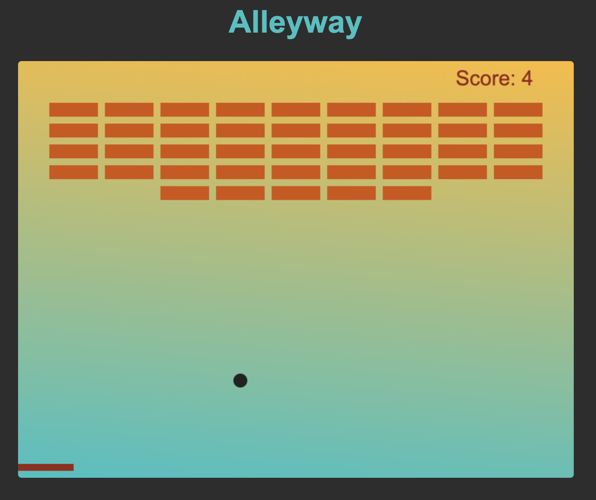
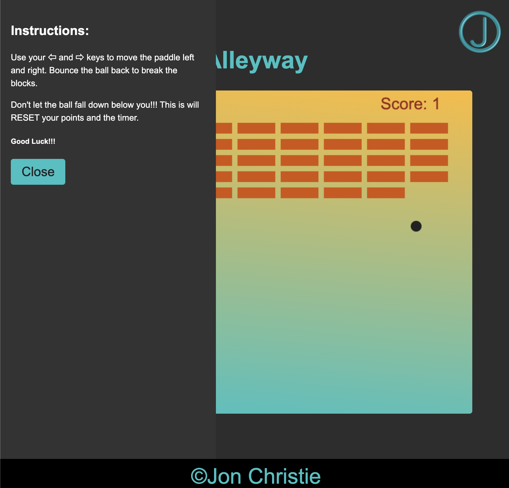

# alleyway
Just the like old school game for Nintendo Gameboy.... along with millions of others! Break the bricks and keep the ball above you! This is a simple way to create this game, so it could use some more features, like tracking high scores, leveling up, increasing difficulty, different shaped and styled levels, and more. The

PLEASE FEEL FREE TO COLLABORATE WITH YOUR IDEAS TO IMPROVE THIS!!!





### Installation
```
Download or clone the files into your own project folder and open index.html in a browser!!! That's it!
```
### Instructions
```
Use your ⇦ and ⇨ keys to move the paddle left and right. Bounce the ball back to break the blocks.

Don't let the ball fall down below you!!! This is will RESET your points and the timer.

Good Luck!!!
```
### Contact


__Jon Christie__ 

GitHub: [mathcodes](https://github.com/mathcodes) 

[<code></code>](https://www.linkedin.com/jonchristie)       
[<code></code>](https://twitter.com/jonpchristie)       
[<code></code>](https://www.youtube.com/channel/UC5GFnN-lv8Yuqc9O3b79k6g)       
[<code></code>](https://www.facebook.com/jonpchristie)       
[<code></code>](https://www.instagram.com/fullstack11235)       
[<code></code>](https://soundcloud.com/jonchristie#/)       
[<code></code>](https://open.spotify.com/artist/07S7aLfxH70VAX64g1WuFw?si=tlOj1OMBRLm-y4sY8Lox3Q)

